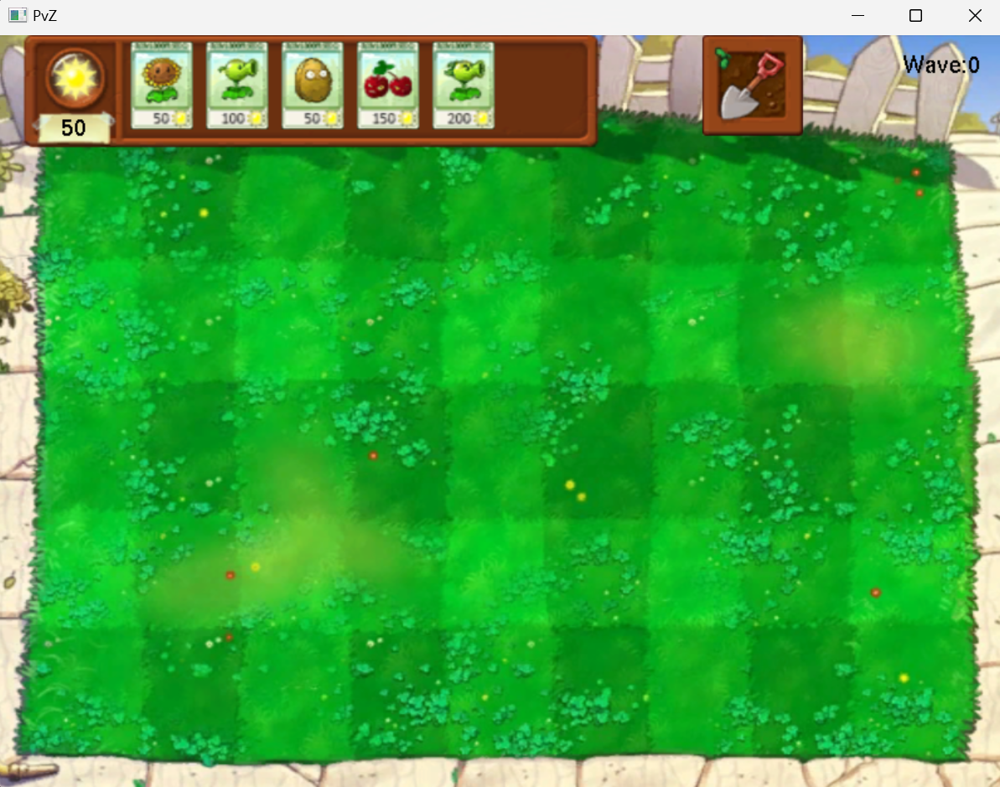
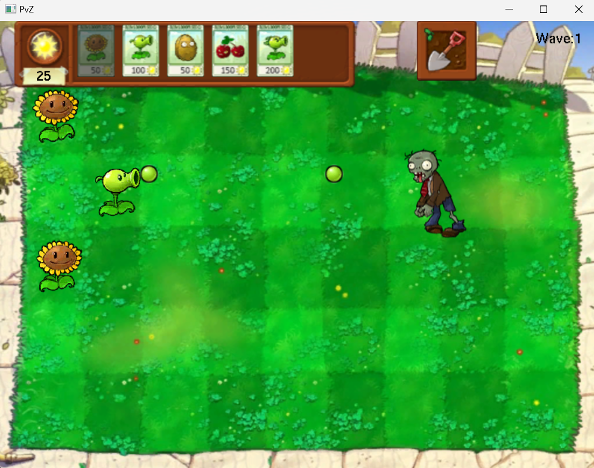
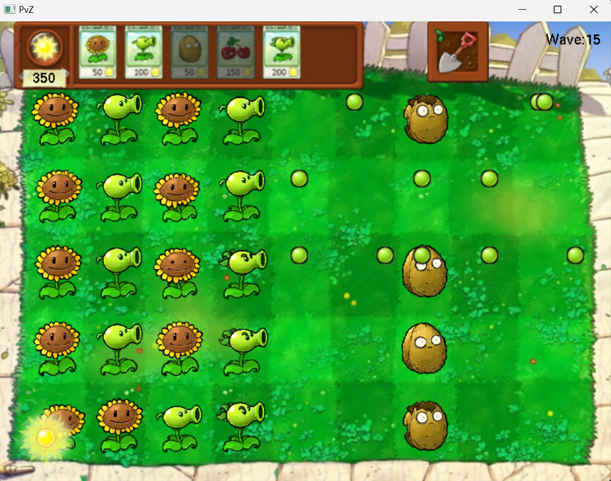
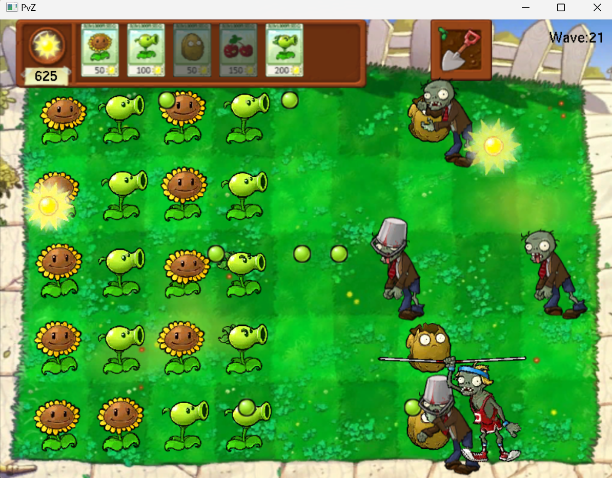

# PvZ Game Project

## Introduction

This is a simple implementation of the game Plants vs Zombies (PvZ). It is created for the final project of the course CS100(2024 Spring) in ShanghaiTech University and is not affiliated with the official PvZ game.

## Installation

Clone the repository: `git clone https://github.com/SherlockZhang666/CS100-Plants_VS_Zombies_Project.git`

## Usage

1. Build the project by CMake.
2. After compiling the project, you can run the game with the following command: `./build/bin/Debug/PvZ.exe`

## Some pictures of the game

